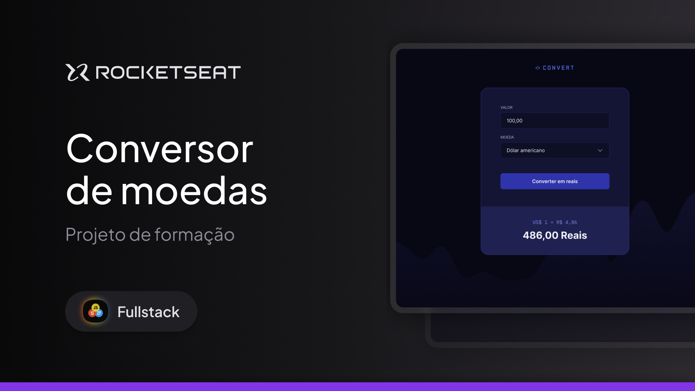

# Convert - Currency Converter

## Sobre o Projeto 💱
O **Convert** é uma aplicação interativa que permite aos usuários **converter valores de reais (BRL) para dólar americano (USD), euro (EUR) e libra esterlina (GBP)**.
O projeto tem como objetivo explorar conceitos essenciais de desenvolvimento web, incluindo manipulação de eventos, validação de entrada e formatação de dados.

  

---

## Funcionalidades do Projeto 📋
- Conversão de valores monetários entre diferentes moedas.
- Formulário interativo para entrada do valor em reais.
- Validação da entrada para aceitar apenas números.
- Apresentação do resultado formatado corretamente (exemplo: 1.000,00 Reais).
- Manipulação do DOM para exibição dinâmica dos resultados.

---

## Conceitos Abordados 📖

### HTML e CSS  
- Implementação de um **formulário** para entrada de valores.  
- Aplicação de estilos para melhorar a experiência do usuário.

### JavaScript  
- Manipulação do DOM com `querySelector` e `getElementById`.
- Gerenciamento de eventos com `addEventListener`.
- Aplicação de `onsubmit` e `preventDefault` para controle do formulário.
- Validação de entrada utilizando **Regex**.
- Criação de função de conversão de moedas.
- Utilização de `try`, `if`, `return`, `catch` para controle de fluxo.
- Estruturas de controle `switch`, `case` e `break` para seleção de moeda.
- Formatação do resultado final para exibição correta.

---

## Tecnologias Utilizadas ✅
- **HTML5**  
- **CSS3**  
- **JavaScript**  

---

## Plataforma de Ensino 🚀
Este projeto faz parte da trilha de aprendizado da **[Rocketseat](https://www.rocketseat.com.br)**.

---

## Autor ✍️
Projeto replicado como parte dos ensinamentos da Rocketseat, com ajustes realizados por **William Milanez**.
